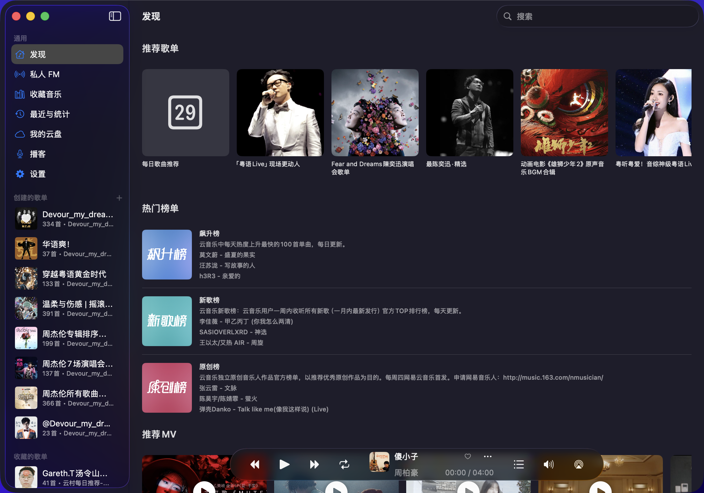
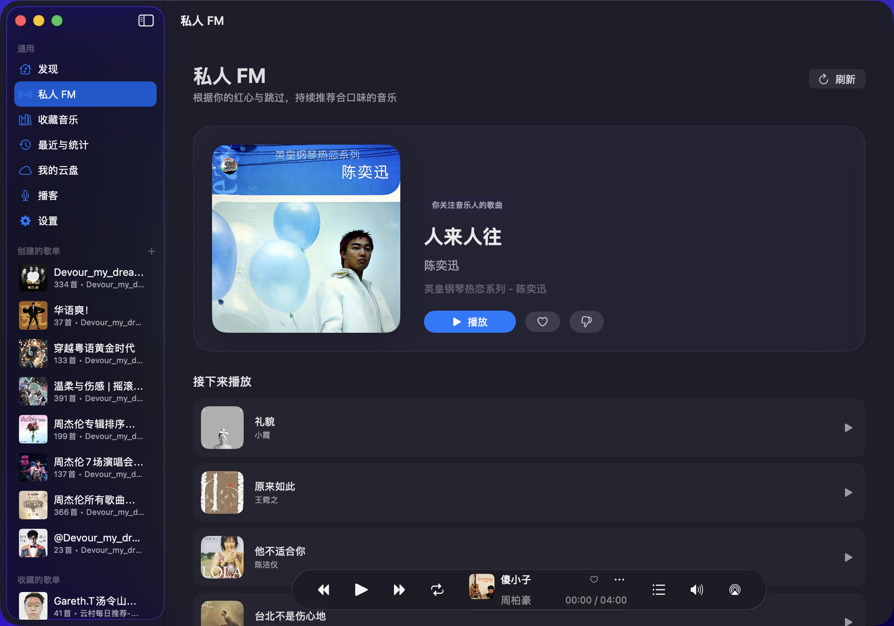
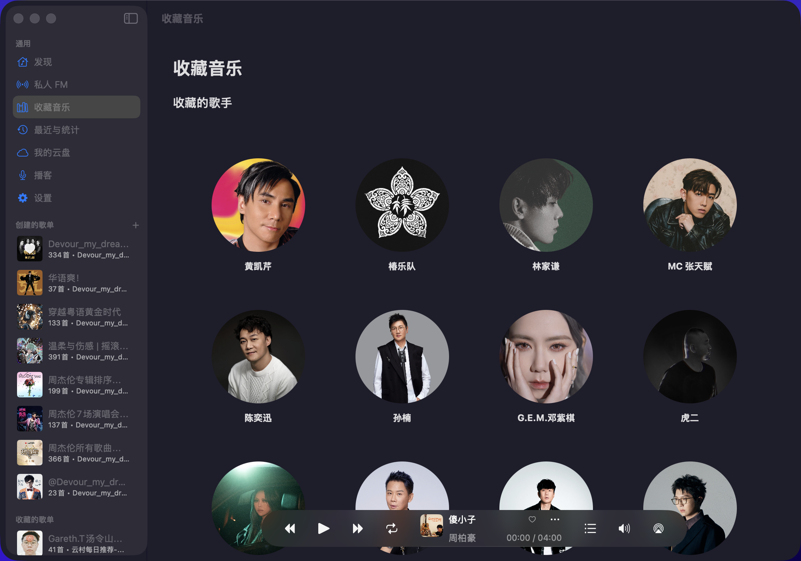
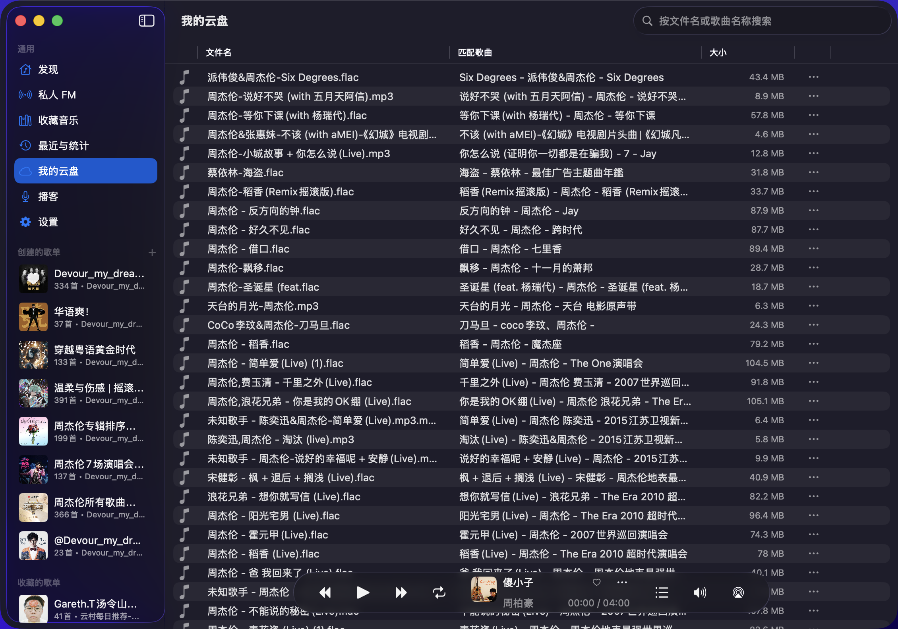
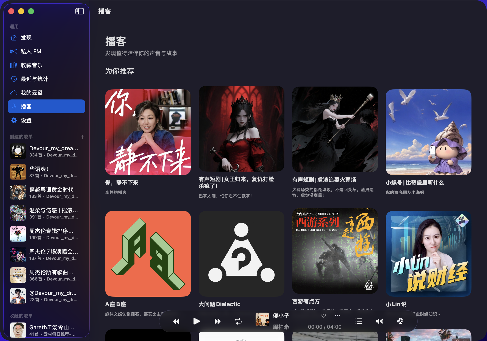

# Auralis

用 SwiftUI 实现的网易云播放器，为 macOS 26 的 Liquid Glass 提供了专门的支持，在旧版本的系统上面的显示可能会出问题

## Screenshots

发现



私人 FM



收藏音乐



我的云盘



播客



## Note & Usage

- 建议使用扫码登录，如果登录失败，需要进行验证，建议直接从网页端复制 Cookie，使用 "Cookie Login" 功能进行登录
- 播放的时候会在 ~/Music/Auralis 下边播放边进行缓存，文件名以网易云的歌曲 ID 命名，默认为可以下载到的最高音质
  - 第一次播放时的缓存过程中因为存在跳转的目标与实际播放目标不匹配的问题，禁用了拖动进度条功能，待到缓存完成后才可拖动进度条
  - 在歌单的功能栏处的 "Download All" 按钮会在后台对所有歌曲进行缓存
  - "Play All" 与 "Add All" 分别是将当前的歌单替换为播放列表和将当前歌单添加到播放列表
- 歌单、歌词的加载缓存，如果需要对歌单进行刷新，可以点 "Refresh Playlist" 按钮
- 点左下角的歌曲封面会切换到歌词界面
  - 歌词界面右上角分别是显示某一句歌词的时间戳和显示罗马音（如果有）

## Installation

### 手动安装（推荐）

从 [Releases](https://github.com/crayonlu/Auralis/releases) 下载最新的 `Auralis.dmg`，将 Auralis 拖入 Applications。

由于应用未经过 Apple 签名与公证，首次打开会提示"无法验证开发者"。可右键 → 打开，或执行下面的命令移除隔离属性：

```bash
xattr -dr com.apple.quarantine /Applications/Auralis.app
```

### 命令行安装 / 更新

也可以用下面的脚本，它会自动从 Release 下载最新版本并处理签名问题：

```bash
curl -sfL https://raw.githubusercontent.com/crayonlu/Auralis/refs/heads/main/.github/update.sh | sh
```

## Acknowledgment

- [QCloudMusicApi](https://github.com/s12mmm3/QCloudMusicApi): 网易云 API 接口
- [CachingPlayerItem](https://github.com/sukov/CachingPlayerItem): 音频缓存
- [AudioStreaming](https://github.com/dimitris-c/AudioStreaming)
- [iOSAACStreamPlayer](https://github.com/UFOooX/iOSAACStreamPlayer)
